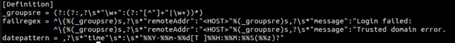

# Setup guide: Nextcloud setup

### Nextcloud module **[WHMCS](https://puqcloud.com/link.php?id=77)**
#####  [Order now](https://puqcloud.com/whmcs-module-nextcloud.php) | [Download](https://download.puqcloud.com/WHMCS/servers/PUQ_WHMCS-Nextcloud/) | [FAQ](https://faq.puqcloud.com/)

## Nextcloud including Nextcloud Office on Debian10 with nginx, MariaDB, PHP 8.1, Let's Encrypt, Redis, Fail2ban and ufw

This guide covers the complete installation and configuration of a Nextcloud server from scratch on Debian, including all required components.

---

## 1. Preparation and installation of nginx web server

Install required packages:

```bash
apt-get install -y \
  curl wget git apt-transport-https gnupg2 \
  imagemagick libmagickcore-6.q16-6 libmagickwand-6.q16-6 \
  software-properties-common dirmngr lsb-release ca-certificates \
  unzip
```

### Configure hostname

Edit `/etc/hosts` with server IP and FQDN:

```
127.0.0.1 localhost
YOUR_SERVER_IP your.domain.com
```

Edit `/etc/hostname`:

```
your.domain.com
```

Reboot the system:

```bash
reboot
```

### Install nginx

Add the nginx repository and install:

```bash
apt-get install -y nginx
```

Remove conflicting web servers:

```bash
apt-get remove -y apache2
```

Enable and start nginx:

```bash
systemctl enable nginx
systemctl start nginx
```

### Configure nginx

Backup the default configuration and create a custom one:

```bash
cp /etc/nginx/nginx.conf /etc/nginx/nginx.conf.bak
```

Key nginx.conf settings include:
- Worker processes and connections
- JSON-formatted logging
- Real IP handling
- File caching parameters
- Security headers

Create required directories:

```bash
mkdir -p /var/log/nextcloud /var/nc_data /var/www/letsencrypt/.well-known/acme-challenge /etc/letsencrypt/rsa-certs /etc/letsencrypt/ecc-certs
```

---

## 2. Installation and configuration of PHP 8.1 (FPM)

Install PHP packages:

```bash
apt-get install -y \
  php-common php8.1-fpm php8.1-gd php8.1-curl php8.1-xml \
  php8.1-zip php8.1-intl php8.1-mbstring php8.1-bz2 \
  php8.1-ldap php8.1-apcu php8.1-bcmath php8.1-gmp \
  php8.1-imagick php8.1-igbinary php8.1-mysql php8.1-redis \
  php8.1-smbclient php8.1-cli php8.1-opcache php8.1-readline \
  imagemagick
```

Optional packages for LDAP/Samba:

```bash
apt-get install -y ldap-utils nfs-common cifs-utils
```

### Configure timezone

```bash
timedatectl set-timezone Europe/Warsaw
```

### Key PHP optimizations

Backup and configure PHP settings:

- **Memory limit:** 1G
- **Max execution time:** 3600 seconds
- **Upload max filesize:** 10G
- **Post max size:** 10G
- **OPCache enabled:** memory 256MB, max files 100000
- Session cookie security enabled
- ImageMagick policy permissions updated for PS, EPS, PDF, XPS files

---

## 3. Installation and configuration of MariaDB 10.8

### Database security hardening

```bash
mysql_secure_installation
```

- Set root password
- Remove anonymous users
- Disable remote root login
- Remove test database

### Database configuration

Custom MariaDB configuration (`/etc/mysql/my.cnf`):
- Character set: utf8mb4
- Default storage engine: InnoDB
- Max connections: 200
- Binlog format: ROW
- Transaction isolation: READ-COMMITTED

### Create Nextcloud database

```sql
CREATE DATABASE nextclouddb CHARACTER SET utf8mb4 COLLATE utf8mb4_general_ci;
CREATE USER nextclouddbuser@localhost identified by 'nextclouddbpassword';
GRANT ALL PRIVILEGES on nextclouddb.* to nextclouddbuser@localhost;
FLUSH privileges;
```

> **Important:** Replace `nextclouddbpassword` with a strong password.

---

## 4. Installing and configuring Redis

Install and configure Redis:

```bash
apt-get install -y redis-server
```

Configuration:
- Port: disabled (set to 0)
- Unix socket enabled with permissions 770
- Max clients: 10240

```bash
usermod -aG redis www-data
```

Set kernel parameter:

```bash
echo "vm.overcommit_memory = 1" >> /etc/sysctl.conf
```

> Reboot the system before Nextcloud installation.

---

## 5. Installation and optimization of Nextcloud (incl. SSL)

### Certbot and Let's Encrypt setup

```bash
apt-get install -y certbot python3-certbot-nginx
```

### nginx vhost configuration

Create `/etc/nginx/conf.d/nextcloud.conf` with:
- Upstream handler: PHP-FPM socket
- HTTP to HTTPS redirect
- SSL certificates from Let's Encrypt
- TLS 1.2 and 1.3 protocols
- Client max body size: 10G
- GZIP compression
- Security headers (HSTS, X-Frame-Options, etc.)
- Nextcloud-specific location blocks

### Generate SSL certificate

```bash
certbot --nginx -d yourdomain.com
```

Auto-renewal crontab:

```
0 12 * * * /usr/bin/certbot renew --quiet
```

### Install Nextcloud

Download and verify:

```bash
cd /usr/local/src
wget https://download.nextcloud.com/server/releases/latest.zip
wget https://download.nextcloud.com/server/releases/latest.zip.md5
md5sum -c latest.zip.md5 < latest.zip
```

Extract and set permissions:

```bash
unzip latest.zip -d /var/www
chown -R www-data:www-data /var/www/nextcloud
```

### Silent installation

```bash
sudo -u www-data php /var/www/nextcloud/occ maintenance:install \
  --database "mysql" \
  --database-name "nextclouddb" \
  --database-user "nextclouddbuser" \
  --database-pass "nextclouddbpassword" \
  --admin-user "YourNextcloudAdmin" \
  --admin-pass "YourNextcloudAdminPassword" \
  --data-dir "/var/nc_data"
```

### Configure trusted domain

```bash
sudo -u www-data php /var/www/nextcloud/occ config:system:set trusted_domains 0 --value=your.domain.com
```

### CLI URL configuration

```bash
sudo -u www-data php /var/www/nextcloud/occ config:system:set overwrite.cli.url --value=https://your.domain.com
```

### Extended configuration

Create `/var/www/nextcloud/config/tweaks.config.php` with settings including:
- Activity expiration: 14 days
- Authentication bruteforce protection enabled
- Blacklisted files: .htaccess, Thumbs.db
- Default phone region
- Preview providers: PNG, JPEG, GIF, BMP, PDF, MP3, TXT, MarkDown
- Redis configuration with Unix socket
- Trashbin retention: auto, 7 days
- Logging: file at `/var/log/nextcloud/nextcloud.log`, level 2
- Log rotation: 100MB

### App management

```bash
sudo -u www-data php /var/www/nextcloud/occ app:disable survey_client
sudo -u www-data php /var/www/nextcloud/occ app:disable firstrunwizard
sudo -u www-data php /var/www/nextcloud/occ app:enable admin_audit
sudo -u www-data php /var/www/nextcloud/occ app:enable files_pdfviewer
```

Optional Nextcloud Office installation:

```bash
sudo -u www-data php /var/www/nextcloud/occ app:install richdocuments
sudo -u www-data php /var/www/nextcloud/occ app:install richdocumentscode
```

### Restart services

```bash
systemctl stop nginx php8.1-fpm
systemctl restart mysql php8.1-fpm redis nginx
```

### Set up cron

As www-data user:

```
*/5 * * * * php -f /var/www/nextcloud/cron.php > /dev/null 2>&1
```

Reconfigure to cron mode:

```bash
sudo -u www-data php /var/www/nextcloud/occ background:cron
```

### Pin packages

Prevent unwanted package updates:

```bash
apt-mark hold nginx* redis* mysql* galera* mariadb* php*
```


*15-nextcloud-setup.png*

---

## 6. System hardening with Fail2ban and UFW

### Fail2ban configuration

Install Fail2ban:

```bash
apt-get install -y fail2ban
```

Create Nextcloud filter (`/etc/fail2ban/filter.d/nextcloud.conf`):
- Regex patterns for login failures
- Trusted domain errors
- Date pattern for JSON log format

Create Nextcloud jail (`/etc/fail2ban/jail.d/nextcloud.local`):

```ini
[nextcloud]
backend = auto
enabled = true
port = 80,443
protocol = tcp
maxretry = 5
bantime = 3600
findtime = 36000
logpath = /var/log/nextcloud/nextcloud.log
```

### UFW firewall configuration

```bash
ufw allow 80/tcp comment "LetsEncrypt(http)"
ufw allow 443/tcp comment "LetsEncrypt(https)"
ufw allow 22/tcp comment "SSH"
ufw enable
```
