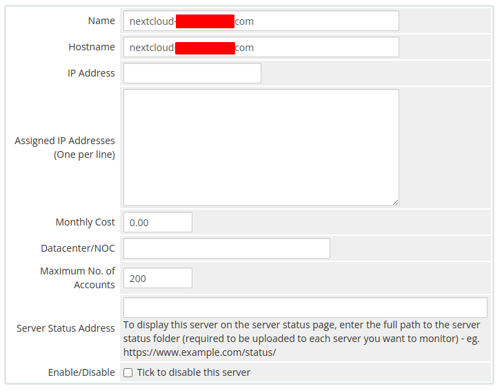
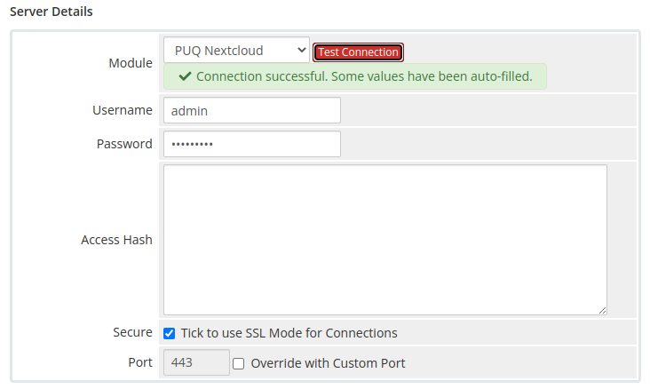
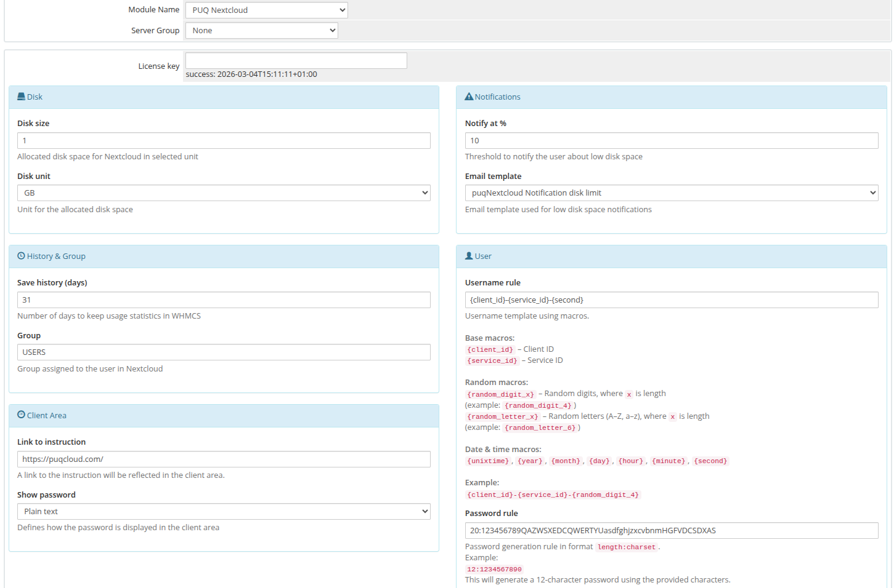

# Setup guide: WHMCS setup

### Nextcloud module **[WHMCS](https://puqcloud.com/link.php?id=77)**
#####  [Order now](https://puqcloud.com/whmcs-module-nextcloud.php) | [Download](https://download.puqcloud.com/WHMCS/servers/PUQ_WHMCS-Nextcloud/) | [FAQ](https://faq.puqcloud.com/)

## System requirements

| Requirement | Minimum version |
|-------------|-----------------|
| **PHP** | 8.2 or higher |
| **WHMCS** | 9.x or higher |
| **ionCube Loader** | v13 or newer (v14, v15) |

> **Note:** The module uses ionCube encoding. Make sure ionCube Loader is installed and active on your server.

> Older module versions for WHMCS 8 are available in PHP-specific directories:
> - PHP 7.4: [https://download.puqcloud.com/WHMCS/servers/PUQ_WHMCS-Nextcloud/php74/](https://download.puqcloud.com/WHMCS/servers/PUQ_WHMCS-Nextcloud/php74/)
> - PHP 8.1: [https://download.puqcloud.com/WHMCS/servers/PUQ_WHMCS-Nextcloud/php81/](https://download.puqcloud.com/WHMCS/servers/PUQ_WHMCS-Nextcloud/php81/)

---

## Step 1: Download the module

```bash
wget https://download.puqcloud.com/WHMCS/servers/PUQ_WHMCS-Nextcloud/php82/PUQ_WHMCS-Nextcloud-latest.zip
```

---

## Step 2: Extract the archive

```bash
unzip PUQ_WHMCS-Nextcloud-latest.zip
```

---

## Step 3: Copy module files

Copy the `puqNextcloud` directory to:

```
WHMCS_WEB_DIR/modules/servers/
```

---

## Step 4: Add server in WHMCS

Navigate to **System Settings** → **Servers** → **Add New Server**

1. Enter the correct **Name** and **Hostname**
2. In the Server Details section, select the **PUQ Nextcloud** module
3. Enter valid Nextcloud web interface credentials (username and password)
4. Click **Test connection** to verify the connection


*04-add-server-1.png*


*05-add-server-2.png*

---

## Step 5: Create product in WHMCS

Navigate to **System Settings** → **Products/Services** → **Create a New Product**

Select the **PUQ Nextcloud** module in the Module settings section.


*06-whmcs-setup.png*
