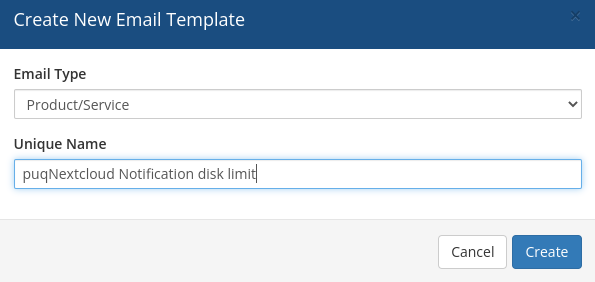

# Email Template (puqNextcloud notification disk limit)

### Nextcloud module **[WHMCS](https://puqcloud.com/link.php?id=77)**
#####  [Order now](https://puqcloud.com/whmcs-module-nextcloud.php) | [Download](https://download.puqcloud.com/WHMCS/servers/PUQ_WHMCS-Nextcloud/) | [FAQ](https://faq.puqcloud.com/)

## Creating the email template

Navigate to **System Settings** → **Email Templates** → **Create New Email Template**

---

## Template configuration

| Parameter | Value |
|-----------|-------|
| **Email Type** | Product/service |
| **Unique Name** | puqNextcloud Notification disk limit |

---

## Email subject

```
Disk space usage {$disk_used_percentage} % - {$username}
```

---

## Email body

```
Dear {$client_name},

We would like to inform you that the disk space usage for your
product/service has reached the notification threshold.

Product/Service: {$service_product_name}
Due Date: {$service_next_due_date}
Username: {$username}

Disk Limit: {$disk_limit}
Disk Used: {$disk_used} ({$disk_used_percentage}%)
Disk Free: {$disk_free} ({$disk_free_percentage}%)

Please take the necessary actions to manage your disk space.

{$signature}
```

---

## Available template variables

The following custom variables are passed to the email template by the module:

| Variable | Description | Example |
|----------|-------------|---------|
| `{$username}` | Nextcloud username | john-42 |
| `{$disk_limit}` | Total disk quota with unit | 10 GB |
| `{$disk_used}` | Used disk space with unit | 8.5 GB |
| `{$disk_free}` | Free disk space with unit | 1.5 GB |
| `{$disk_used_percentage}` | Used space as percentage | 85 |
| `{$disk_free_percentage}` | Free space as percentage | 15 |

In addition, all standard WHMCS product/service merge fields are available (e.g. `{$client_name}`, `{$service_product_name}`, `{$service_next_due_date}`, `{$signature}`).

> **Note:** Notifications are sent automatically during the WHMCS daily cron execution when disk usage reaches the threshold configured in the product settings ("Notify at %").

---

## Screenshots


*07-email-template-1.png*


*08-email-template-2.png*
