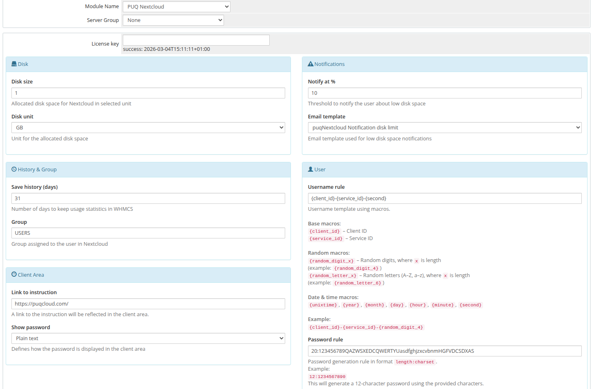

# Product Configuration

### Nextcloud module **[WHMCS](https://puqcloud.com/link.php?id=77)**
#####  [Order now](https://puqcloud.com/whmcs-module-nextcloud.php) | [Download](https://download.puqcloud.com/WHMCS/servers/PUQ_WHMCS-Nextcloud/) | [FAQ](https://faq.puqcloud.com/)

## Add new product to WHMCS

Navigate to **System Settings** → **Products/Services** → **Create a New Product**

Select the **PUQ Nextcloud** module in the Module settings section.

---

## Configuration parameters

| Parameter | Description |
|-----------|-------------|
| **License key** | A pre-purchased license key for the PUQ Nextcloud module. The license must be active for correct operation. After saving, the verification status is displayed below the field. |
| **Disk size** | Allocated disk space for the Nextcloud user. Set to **0** for unlimited quota. Minimum value: 0. |
| **Disk unit** | Unit used for the allocated disk space. Available options: **MB**, **GB**, **TB**, **PB**. |
| **Notify at %** | Disk usage threshold in percent (1–100). A notification email is sent when usage reaches this value. Default: **90**. Set to **0** to disable notifications. |
| **Email template** | Email template used for low disk space notifications. Select from available Product/service type email templates. The template must be created manually in WHMCS (see [Email Template](#) page). |
| **Save history (days)** | Number of days to store disk usage statistics in WHMCS. Older records are automatically deleted during cron execution. |
| **Group** | Nextcloud group assigned to the user on the server side. The group is created automatically if it does not exist. When changing packages, the user is removed from all groups and added to the new group. |
| **Username rule** | Rule for automatic username generation using macros (see below). Default: `{client_id}-{service_id}`. |
| **Password rule** | Password generation rule in `length:charset` format (see below). Default: `12:123456789QAZWSXEDCRFVTGBYHNUJMIKqazwsxedcrfvtgbyhnujmikolp`. |
| **Link to instruction** | URL to instructions displayed as a button in the client area. Leave empty to hide the button. |
| **Show password** | Defines how the password is shown in the client area. Options: **Show button** (hidden by default, revealed on click), **Plain text** (always visible), **No** (hidden, no option to reveal). |

---

## Username rule — available macros

The username is generated automatically when a new account is created. You can use the following macros:

| Macro | Description | Example |
|-------|-------------|---------|
| `{client_id}` | WHMCS client ID | 123 |
| `{service_id}` | WHMCS service ID | 456 |
| `{unixtime}` | Current Unix timestamp | 1707638400 |
| `{year}` | Current year | 2026 |
| `{month}` | Current month (01–12) | 02 |
| `{day}` | Current day (01–31) | 12 |
| `{hour}` | Current hour (00–23) | 14 |
| `{minute}` | Current minute (00–59) | 30 |
| `{second}` | Current second (00–59) | 45 |
| `{random_digit_x}` | x random digits (0–9) | `{random_digit_4}` → 7394 |
| `{random_letter_x}` | x random letters (A–Z, a–z) | `{random_letter_6}` → aBcDeF |

**Examples:**
- `{client_id}-{service_id}` → `123-456`
- `nc-{random_digit_6}` → `nc-384729`
- `user-{client_id}-{random_letter_4}` → `user-123-aBcD`

> **Note:** If the generated username already exists on the Nextcloud server, the module automatically appends a counter: `username-1`, `username-2`, etc.

---

## Password rule — format

The password rule uses the format `length:charset`, where:
- **length** — number of characters to generate
- **charset** — set of characters to use

**Examples:**
- `12:abcdefghijklmnopqrstuvwxyz0123456789` — 12 lowercase alphanumeric characters
- `16:ABCDEFGHIJKLMNOPQRSTUVWXYZabcdefghijklmnopqrstuvwxyz0123456789` — 16 mixed-case alphanumeric
- `20:0123456789` — 20 digits only

> If no rule is specified, a 12-character password is generated from a default character set.

---

## Important notes

> **Warning:** This module works only as a **server module** (Products/Services). It cannot be used as an addon product. Attempting to use it with addon products will result in an error.

---

## Screenshot

*09-product-configuration.png*
