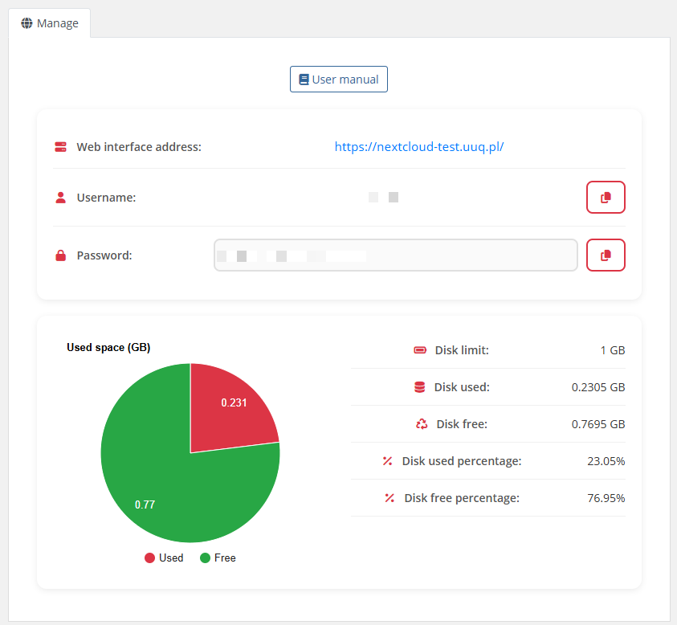

# Home screen

### Nextcloud module **[WHMCS](https://puqcloud.com/link.php?id=77)**
#####  [Order now](https://puqcloud.com/whmcs-module-nextcloud.php) | [Download](https://download.puqcloud.com/WHMCS/servers/PUQ_WHMCS-Nextcloud/) | [FAQ](https://faq.puqcloud.com/)

## Client area home screen

The end customer, after logging in to the client panel, sees the service management page with the following sections:

### Service information

- **User manual** — a button linking to the instruction URL (only displayed if configured by the administrator in product settings, "Link to instruction" field)
- **Web interface address** — clickable link to the Nextcloud server (automatically handles HTTPS/HTTP and non-standard ports)
- **Username** — the Nextcloud username with a **copy-to-clipboard** button
- **Password** — displayed according to the "Show password" product setting:
  - **Show button** — password is hidden by default, revealed when the user clicks the show button; copy-to-clipboard button is always available
  - **Plain text** — password is always visible in plain text; copy-to-clipboard button available
  - **No** — password is completely hidden with no option to reveal

### Disk usage

- **Pie chart** — visual representation of used vs. free disk space (powered by Google Charts)
- **Data table** with the following fields:
  - Disk limit (displays "Unlimited" if quota is set to 0)
  - Disk used
  - Disk free
  - Disk used percentage
  - Disk free percentage

### Sidebar navigation

The client area sidebar contains two menu items:
- **Information** — the main service details page (described above)
- **Used space statistics** — historical disk usage charts (see [Disk statistics](#) page)

> **Note:** If the service status is not Active or if the Nextcloud user cannot be found, an error page is displayed instead.

---

## Screenshot

*10-home-screen.png*
