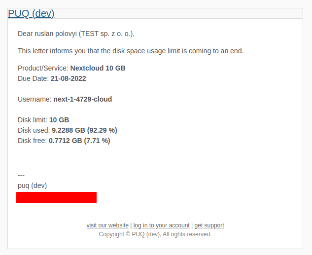

# Email notification

### Nextcloud module **[WHMCS](https://puqcloud.com/link.php?id=77)**
#####  [Order now](https://puqcloud.com/whmcs-module-nextcloud.php) | [Download](https://download.puqcloud.com/WHMCS/servers/PUQ_WHMCS-Nextcloud/) | [FAQ](https://faq.puqcloud.com/)

## Email notification example

Below you can see an example of an email notification regarding data limit.

When the customer's disk usage exceeds the configured notification threshold (set in the product configuration as "Notify at %"), the system automatically sends an email notification using the configured email template.

---

## Screenshot

*11-email-notification.png*
