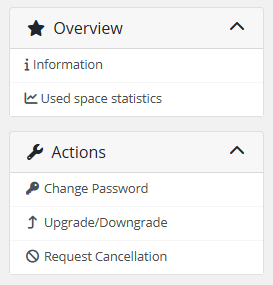
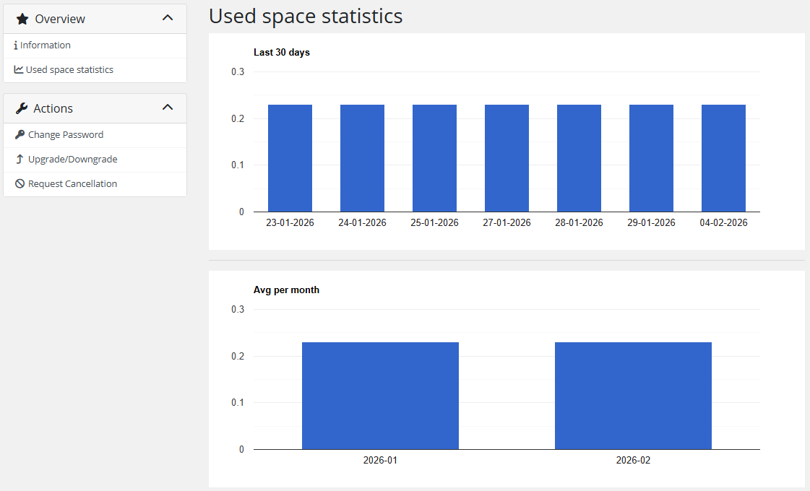

# Disk statistics

### Nextcloud module **[WHMCS](https://puqcloud.com/link.php?id=77)**
#####  [Order now](https://puqcloud.com/whmcs-module-nextcloud.php) | [Download](https://download.puqcloud.com/WHMCS/servers/PUQ_WHMCS-Nextcloud/) | [FAQ](https://faq.puqcloud.com/)

## Disk usage statistics

The client can check the data usage statistics in the menu item **"Used space statistics"**.

The statistics page displays two charts:

### Last 30 days

A column chart showing daily disk usage for the last 30 days. Each bar represents the amount of disk space used on that day.

### Average per month

A column chart showing the average monthly disk usage. This provides a long-term overview of storage consumption trends.

Both charts are powered by Google Charts and automatically resize to fit the browser window. The data is collected by the WHMCS cron job and stored in the database for the number of days configured in the product settings ("Save history" parameter).

> **Note:** Statistics data is only available after the WHMCS cron has run at least once with the UsageUpdate function. The retention period is configurable per product in the "Save history (days)" setting.

---

## Screenshots

*12-disk-statistics-1.png*

*13-disk-statistics-2.png*
