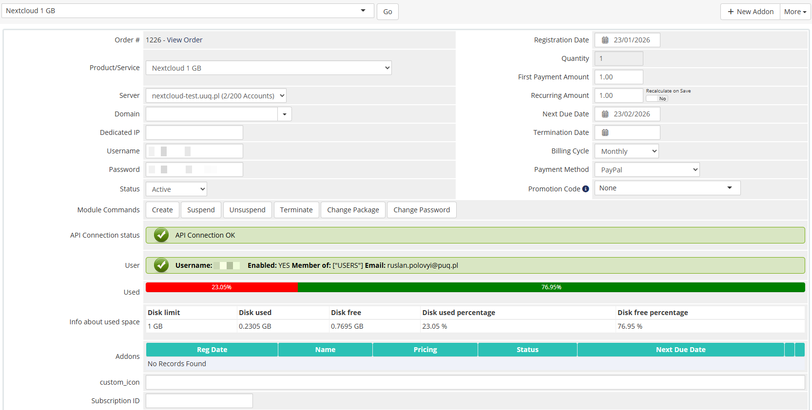

# Product Information

### Nextcloud module **[WHMCS](https://puqcloud.com/link.php?id=77)**
#####  [Order now](https://puqcloud.com/whmcs-module-nextcloud.php) | [Download](https://download.puqcloud.com/WHMCS/servers/PUQ_WHMCS-Nextcloud/) | [FAQ](https://faq.puqcloud.com/)

## Admin area product information

The administrator can view detailed service information in the WHMCS admin panel on the product/service page. The module adds a custom panel in the **Module Data** section with the following information:

### License verification status

Displays the current license status with a colored indicator:
- **Green** — license is valid and active
- **Red** — license is invalid, expired, or missing

### API connection status

Shows the result of a real-time connection test to the Nextcloud server, confirming that the API credentials are working correctly.

### User information

| Field | Description |
|-------|-------------|
| **Username** | The Nextcloud username assigned to this service |
| **Enabled** | Whether the user account is currently enabled or disabled |
| **Group** | The Nextcloud group(s) the user belongs to |
| **Email** | The email address associated with the Nextcloud account |

### Disk usage

- **Visual progress bar** — a colored bar showing the proportion of used vs. free disk space
- **Detailed table** with:
  - Disk limit (total allocated quota)
  - Disk used (current usage)
  - Disk free (remaining space)
  - Disk used percentage
  - Disk free percentage

### Available management actions

The standard WHMCS module command buttons are available:
- **Create** — provision a new Nextcloud account
- **Suspend** — disable the Nextcloud user
- **Unsuspend** — re-enable the Nextcloud user
- **Terminate** — permanently delete the Nextcloud user
- **Change Password** — reset the user's password
- **Change Package** — update disk quota and group assignment (used during upgrades/downgrades)

---

## Screenshot

*14-product-information.png*
